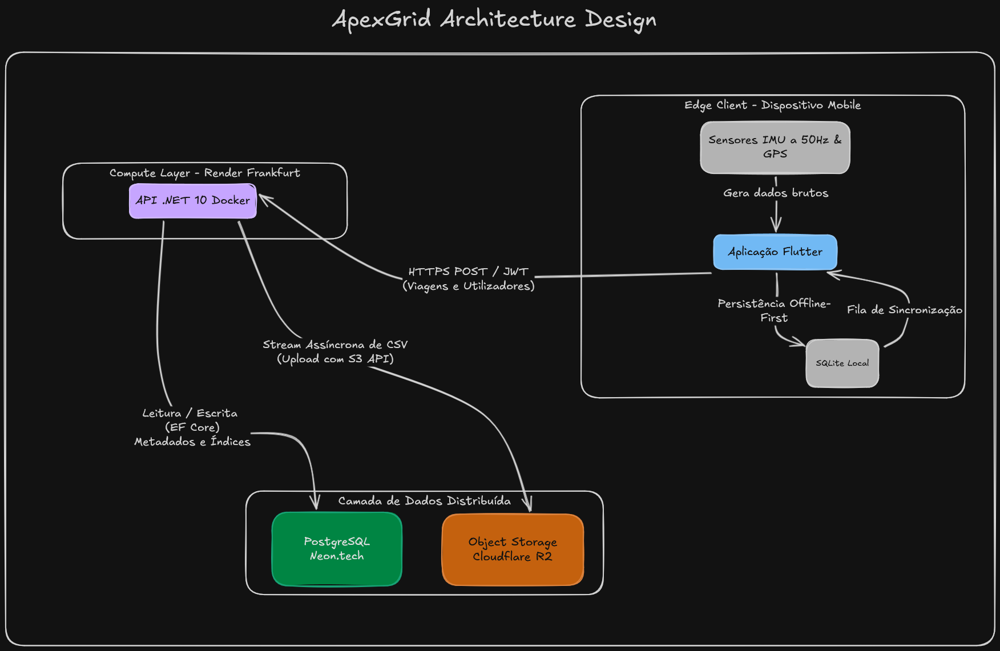

# 🏍️ ApexGrid — Ecossistema de Telemetria de Alta Performance

<p align="center">
  
  
  
  
  
</p>

O **ApexGrid** é uma plataforma de telemetria e análise de dados de condução em tempo real para motociclistas. Elimina a necessidade de hardware proprietário dispendioso, transformando os sensores nativos do smartphone num centro de aquisição de dados de alta frequência (50Hz). 

Os dados são processados de forma assíncrona através de uma infraestrutura cloud descentralizada, garantindo latência mínima, resiliência *offline-first* e armazenamento massivo otimizado.

---

## Clonar Projeto
```bash
git clone --recursive https://github.com/LuisCarvalhoGit/ApexGrid.git
```

## 📁 Estrutura do Ecossistema (Repositórios)

O código-fonte deste ecossistema está modularizado em dois repositórios independentes de forma a respeitar a separação de conceitos (*Separation of Concerns*). **Clica nos links abaixo para aceder ao código e documentação técnica de cada componente:**

* 💻 **[ApexGrid-API (Backend)](https://github.com/LuisCarvalhoGit/ApexGrid-API)**: API C# .NET 10 desenvolvida sob os padrões de *Clean Architecture*. Contém a infraestrutura Docker, migrações do Entity Framework Core e a orquestração de storage.
* 📱 **[ApexGrid-Mobile (Frontend)](https://github.com/LuisCarvalhoGit/ApexGrid-Mobile)**: Aplicação mobile em Flutter. Contém a lógica de subscrição de streams de sensores (Acelerómetro, Giroscópio, GPS), gestão de estado reativa (Riverpod) e persistência local (SQLite).

---

## 🏛️ Arquitetura Distribuída (Edge-to-Cloud)

O sistema foi desenhado dividindo a computação entre a captura intensiva na ponta (*Edge Processing*) e microserviços na nuvem para persistência e armazenamento.



## 📱 Manual de Utilização e Fluxo de Dados


### 1. Autenticação Segura
O utilizador instala a aplicação e realiza o registo. A password é enviada de forma segura e encriptada (**BCrypt**). A API devolve um **Token JWT** que o Flutter armazena na *Secure Storage* do dispositivo (encriptação por hardware). A partir daqui, o utilizador tem sessão persistente e segura.

### 2. Captura na Estrada (Offline-First)
Ao iniciar uma "Nova Viagem", a aplicação subscreve os canais de hardware do telemóvel recolhendo dados a **50Hz**. 
Toda a telemetria é estruturada em memória e gravada continuamente numa base de dados local **SQLite**. Isto permite que a viagem seja registada em zonas montanhosas remotas sem necessidade de cobertura de rede (4G/5G).

### 3. Sincronização Cloud
Ao terminar a viagem, os dados são compilados num ficheiro `.csv`. Assim que existe uma ligação de internet estável, o utilizador pode acionar a sincronização:

1. A API recebe o pedido, valida o JWT e cria o metadado da viagem no **PostgreSQL (Neon)**.
2. Simultaneamente, abre um *Pipeline Stream* em tempo real para o **Cloudflare R2**, transferindo o ficheiro físico de forma assíncrona com *zero egress fees*. O ficheiro local pode então ser eliminado do telemóvel.

---

## 🚀 Próximos Passos (Roadmap)

* **Inteligência de Fusão de Sensores:** Implementação do *Filtro de Madgwick* para cruzar dados do Magnetómetro e Giroscópio e calcular o *Lean Angle* (ângulo de inclinação lateral) com precisão.
* **Compressão GZip:** Compactação da *stream* de dados na origem para reduzir o tráfego de rede em 85%.
* **Sincronização em Background:** Mecanismo autónomo de *retry* de upload quando a rede é restaurada.